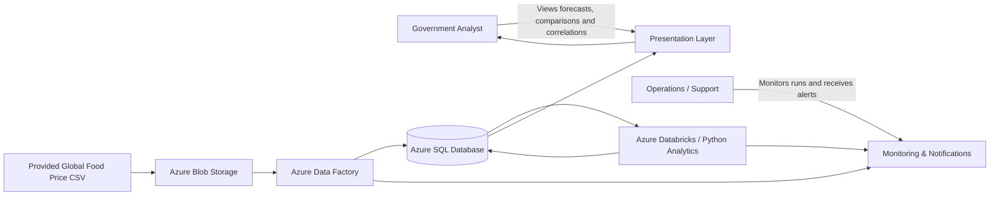
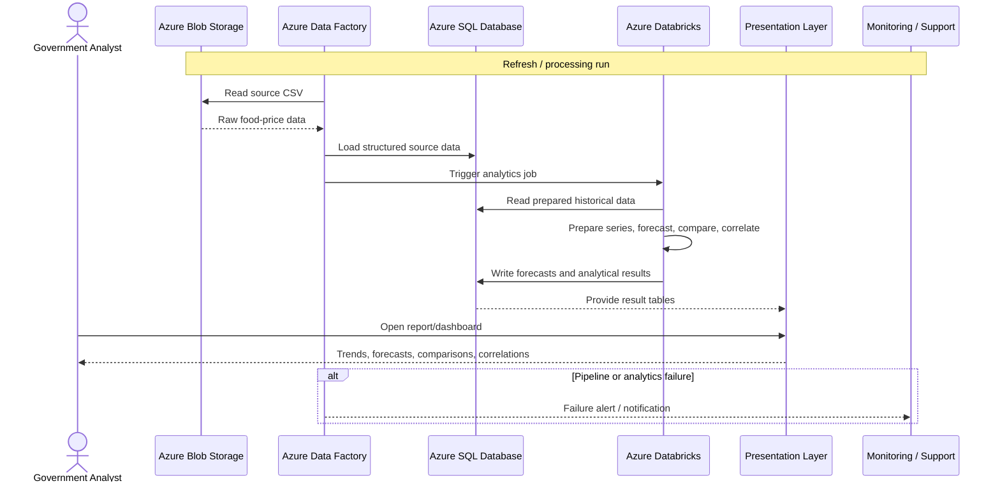

# Requirements Engineering Document
## Big Data in the Cloud — Team 9

**Contract country:** Djibouti  
**Comparison country:** Haiti  
**Project:** Food Price Projection and Country Comparison  
**Status:** Draft for exam implementation  
**Version:** 1.0  

---

## 1. Purpose

This document defines the requirements for a cloud-based analytics solution developed for a government customer. The solution shall use the provided global food-price dataset to:

1. project available food prices for available commodities in **Djibouti**;
2. compare Djibouti with **Haiti** and identify differences;
3. identify possible correlations related to price fluctuations and differences between the two countries;
4. present the results in a form that government users can review;
5. provide a deployable, supportable, and cost-controlled cloud solution.

The document follows the course approach to Software Requirements Specification (SRS): requirements are defined before the final technical design, so that architecture, implementation, testing, pricing, operations, and support can be traced back to customer needs.

---

## 2. Source Basis

This requirements document is based on the supplied **Big Data in the Cloud exam brief** and the provided dataset.

### Explicit exam requirements

The exam brief requires the team to:

- project available food prices for the available commodities;
- compare the contract country with the assigned comparison country and find differences;
- identify possible correlations for price fluctuations and country differences;
- define requirements, SLA, pricing, and architecture;
- digitalize the data in SQL;
- streamline the data;
- set notifications;
- join data;
- provide data presentation and analysis;
- keep Azure consumption within the project budget.

### Team assignment

| Team | Contract country | Comparison country |
|---|---|---|
| 9 | Djibouti | Haiti |

### Available source fields

The supplied CSV contains structured fields including country, market, commodity, currency, price type, unit of measure, month, year, and price. Examples include:

`adm0_name`, `mkt_name`, `cm_id`, `cm_name`, `cur_name`, `pt_name`, `um_name`, `mp_month`, `mp_year`, `mp_price`.

---

## 3. Business Objective

The government customer requires a repeatable analytical solution that converts historical food-price observations into useful decision-support information.

The solution should allow a government analyst to answer questions such as:

- How have food prices developed over time in Djibouti?
- What are the projected prices for commodities with sufficient historical data?
- How does Djibouti differ from Haiti?
- Which commodities show similar or different price movements across the two countries?
- Which relationships or correlations may be relevant for further investigation?
- When was the data last processed, and did the latest processing run succeed?

---

## 4. Stakeholders

| Stakeholder | Role / interest |
|---|---|
| Government analyst | Reviews forecasts, comparisons, trends, and correlations |
| Government decision-maker | Uses summarized results for planning and policy discussions |
| Data analytics consulting team | Designs, implements, validates, and demonstrates the solution |
| Operations / support role | Monitors pipeline execution and reacts to failures |
| Course examiners | Assess requirements, architecture, deployment, pricing, SLA, and presentation |

---

## 5. Scope

### In scope

- ingestion of the provided global food-price CSV;
- preservation of the raw source data;
- structured storage in SQL;
- filtering and preparation of Djibouti and Haiti data;
- commodity-level time-series preparation;
- price projection for commodities with sufficient usable history;
- comparison of the two countries;
- correlation analysis of price movements;
- storage of analytical outputs;
- dashboard/report presentation;
- monitoring and failure notification;
- Azure cost estimation and cost-control measures;
- SLA/SLO definition for the prototype solution.

### Out of scope for the exam prototype

- real-time market-price collection from external providers;
- automatic currency conversion using a live FX service;
- causal claims about inflation, conflict, weather, exchange rates, or supply chains unless an external explanatory dataset is explicitly added;
- production-grade identity federation for a national government;
- 24/7 high-availability production deployment across multiple Azure regions;
- public internet access to the raw database.

---

## 6. System Context Diagram



**Interpretation:** Blob Storage holds the raw file, Data Factory orchestrates ingestion, Azure SQL provides structured persistent storage, Databricks performs forecasting/correlation processing, and the presentation layer exposes results to government users. Monitoring covers operational failures.

---

## 7. Functional Requirements

The word **shall** denotes a mandatory requirement.

| ID | Requirement | Priority | Acceptance criterion |
|---|---|---|---|
| FR-01 | The system shall ingest the provided global food-price CSV from cloud file storage into a structured SQL data store. | Must | A successful pipeline run loads the source dataset into the target SQL structure without manual row-by-row processing. |
| FR-02 | The system shall preserve the original source data separately from transformed/analytical data. | Must | The raw source remains available and can be distinguished from processed tables. |
| FR-03 | The system shall identify and process data for Djibouti as the contract country and Haiti as the comparison country. | Must | Queries/processing return observations for both assigned countries. |
| FR-04 | The system shall prepare a consistent time field from the available month and year information for time-series analysis. | Must | Processed records contain a usable monthly date/time key. |
| FR-05 | The system shall create analytical series for available commodities with sufficient usable historical observations. | Must | Each eligible commodity can be represented as a chronological price series. |
| FR-06 | The system shall generate price projections for eligible commodities in Djibouti. | Must | Forecast output contains commodity, forecast period, predicted value, and processing timestamp. |
| FR-07 | The forecast horizon shall be configurable rather than hard-coded. | Should | Horizon can be changed through a parameter/configuration without rewriting the whole solution. |
| FR-08 | The system shall compare Djibouti and Haiti for commodities that can be meaningfully matched across the two countries. | Must | A comparison output identifies common/matched commodities and country-specific results. |
| FR-09 | The system shall calculate and present differences in price behaviour between Djibouti and Haiti. | Must | Output includes at least one defined comparison metric for matched commodities. |
| FR-10 | The system shall calculate possible correlations in price movements for relevant commodity series. | Must | Correlation results are produced for series meeting the defined data-quality threshold. |
| FR-11 | The system shall clearly separate correlation from causation in the analytical output. | Must | Presentation/report does not describe correlation results as proof of causal relationships. |
| FR-12 | The system shall store forecast and analytical results in a structured form that can be consumed by the presentation layer. | Must | Result tables/files can be queried independently of the notebook execution. |
| FR-13 | The system shall provide a presentation layer for government users to review trends, forecasts, comparisons, and correlations. | Must | A demonstrable report/dashboard contains the required analytical views. |
| FR-14 | The system shall record the latest successful processing time for the analytical outputs. | Should | Dashboard/result table displays or contains a last-processed timestamp. |
| FR-15 | The system shall notify the operations/support role when a critical pipeline execution fails. | Must | A deliberately failed test run produces a notification or demonstrable alert event. |
| FR-16 | The system shall support manual execution for testing and demonstration. | Must | Team can start the pipeline manually during development/exam demonstration. |
| FR-17 | The solution shall support scheduled or event-driven execution if future data updates are introduced. | Should | Architecture/pipeline can be connected to an ADF trigger without redesigning the whole solution. |

---

## 8. Data Quality and Comparison Requirements

These requirements are **derived from the structure of the provided dataset** and are necessary to avoid misleading analysis; they are not explicitly spelled out in the exam brief.

| ID | Requirement | Priority | Acceptance criterion |
|---|---|---|---|
| DQ-01 | The solution shall retain commodity identifiers, units of measure, price type, currency, market, and country information during data preparation. | Must | Processed data maintains the fields needed to interpret a price observation. |
| DQ-02 | The system shall not treat prices with incompatible units or price types as directly comparable without an explicit normalization rule. | Must | Comparison logic includes unit/price-type compatibility checks or flags incompatibility. |
| DQ-03 | When currencies differ and no FX normalization is implemented, the solution shall avoid interpreting raw nominal price levels as directly equivalent purchasing values. | Must | Report documents the limitation and uses an appropriate normalized movement/index metric where needed. |
| DQ-04 | Missing, invalid, or insufficient time-series observations shall be handled according to a documented rule. | Must | Forecasting step either processes the series or marks it ineligible with a reason. |
| DQ-05 | The solution shall document the aggregation rule used when multiple markets exist for the same country, commodity, and month. | Must | Aggregation method is stated and reproducible. |

---

## 9. Non-Functional Requirements

| ID | Requirement | Category | Acceptance criterion |
|---|---|---|---|
| NFR-01 | Total Azure consumption for the exam solution shall remain within the **CHF 250 team budget**. | Cost | Azure estimate and actual cost monitoring demonstrate compliance. |
| NFR-02 | Expensive compute resources shall run only when required and shall be stopped/auto-terminated when idle where supported. | Cost efficiency | Databricks compute has an auto-termination/cost-control configuration or documented operating procedure. |
| NFR-03 | The solution shall use managed Azure services where practical to reduce infrastructure administration. | Maintainability | Architecture uses managed services such as Blob Storage, ADF, Azure SQL, and Databricks rather than unnecessary self-managed VMs. |
| NFR-04 | The pipeline and analytics workflow shall be reproducible. | Reliability | A second run using the same input/configuration produces the same processing structure and comparable outputs. |
| NFR-05 | Secrets and credentials shall not be stored directly in GitHub source files. | Security | Repository contains no passwords, access keys, or connection secrets. |
| NFR-06 | Access to Azure resources shall follow least-privilege principles appropriate to the exam environment. | Security | Team access is limited to required resources/roles. |
| NFR-07 | The analytical outputs shall be understandable to non-technical government users. | Usability | Dashboard uses clear labels, units, dates, country names, and explanatory notes. |
| NFR-08 | The solution shall provide enough monitoring information to determine whether the latest pipeline run succeeded or failed. | Operability | Run status is visible in Azure monitoring and a failure path is demonstrable. |
| NFR-09 | The architecture shall remain extensible to additional countries or future source files without redesigning the entire solution. | Scalability / extensibility | Country/file selection can be parameterized or handled through configuration. |

---

## 10. Assumptions and Open Decisions

The following items are **not explicitly fixed by the exam brief** and must therefore be treated as assumptions or decisions to be confirmed by the team/customer.

| ID | Assumption / decision | Current prototype choice |
|---|---|---|
| A-01 | Forecast horizon | **12 months** as a working prototype assumption; configurable and subject to confirmation |
| A-02 | Source refresh frequency | Source file is static for the exam; architecture remains capable of future scheduled/event-driven refreshes |
| A-03 | Presentation technology | Power BI Desktop for exam demonstration; a production customer-facing deployment would require an agreed shared BI/reporting delivery model |
| A-04 | Forecasting technology | Python in Azure Databricks |
| A-05 | Data orchestration | Azure Data Factory |
| A-06 | Raw storage | Azure Blob Storage |
| A-07 | Structured storage | Azure SQL Database |
| A-08 | Notification mechanism | Azure Monitor and/or Logic Apps, depending final implementation |
| A-09 | Cross-country absolute price comparison | Only performed when unit, price type, and currency treatment are compatible; otherwise normalized price movements are preferred |

---

## 11. Requirement-to-Solution Traceability

This table shows how business needs drive the current architecture. It is **traceability**, not a claim that a specific Azure service was mandated by the exam.

| Requirement(s) | Need | Proposed implementation |
|---|---|---|
| FR-01, FR-02 | Raw ingestion and preservation | Azure Blob Storage + Azure Data Factory |
| FR-01, FR-03, FR-04, FR-12 | Structured queryable data | Azure SQL Database |
| FR-05–FR-11 | Forecasting, comparison, correlation analysis | Azure Databricks + Python |
| FR-13, NFR-07 | Government-facing analytical presentation | Power BI Desktop for exam prototype |
| FR-15, NFR-08 | Operational failure notification | Azure Monitor / Logic Apps |
| NFR-01, NFR-02 | Cost control | Small SKUs, pay-as-you-go, Databricks auto-termination, Azure cost monitoring |
| NFR-05, NFR-06 | Security | Azure RBAC + secrets kept outside GitHub |

---

## 12. Processing Sequence Diagram



---

## 13. Key Acceptance Scenarios

### AC-01 — Successful ingestion

**Given** the supplied CSV is available in Blob Storage,  
**when** the ingestion pipeline is executed,  
**then** the raw observations are available in Azure SQL and the pipeline reports success.

### AC-02 — Djibouti forecast

**Given** an eligible Djibouti commodity has sufficient historical observations,  
**when** the analytics workflow executes,  
**then** forecast records are produced for the configured forecast horizon.

### AC-03 — Djibouti vs Haiti comparison

**Given** a commodity can be matched meaningfully between Djibouti and Haiti,  
**when** the comparison logic executes,  
**then** the output contains comparable time periods and a defined difference/movement metric.

### AC-04 — Correlation analysis

**Given** two price series satisfy the minimum data-quality rule,  
**when** correlation analysis is executed,  
**then** a correlation result is produced and presented as association rather than causation.

### AC-05 — Failure notification

**Given** a critical pipeline activity fails,  
**when** Azure records the failure,  
**then** the designated operations/support path receives or can demonstrate a failure notification.

### AC-06 — Government presentation

**Given** the latest successful results exist,  
**when** a government analyst opens the presentation layer,  
**then** the analyst can review at minimum commodity trends, forecasts, Djibouti-vs-Haiti comparisons, and correlation outputs.

### AC-07 — Budget compliance

**Given** the selected Azure architecture and expected usage,  
**when** the team reviews the Azure pricing estimate and actual exam-environment consumption,  
**then** expected consumption remains within the CHF 250 project budget.

---

## 14. GitHub Repository Expectations

Recommended repository structure:

```text
big-data-cloud-team9/
├── README.md
├── docs/
│   ├── REQUIREMENTS.md
│   ├── architecture.md
│   ├── sla.md
│   └── pricing.md
├── notebooks/
│   └── food_price_analysis.ipynb
├── sql/
│   ├── create_tables.sql
│   └── analytical_views.sql
├── adf/
│   └── README.md
├── powerbi/
│   └── README.md
└── data/
    └── README.md
```

### Repository security rule

Do **not** commit:

- Azure passwords;
- SQL passwords;
- storage access keys;
- SAS tokens;
- Databricks personal access tokens;
- connection strings containing secrets;
- the original dataset if course/licensing rules do not permit redistribution.

Use placeholder configuration examples instead.

---

## 15. Requirements Summary

The highest-priority customer outcomes are:

1. reliable ingestion and structured storage of the supplied food-price data;
2. projections for eligible Djibouti commodities;
3. meaningful comparison with Haiti;
4. correlation analysis without overstating causality;
5. a clear government-facing presentation of results;
6. monitored and supportable processing;
7. a solution whose Azure consumption remains within the exam budget.

These requirements provide the basis for the architecture, implementation, pricing, SLA, testing, and final presentation.
