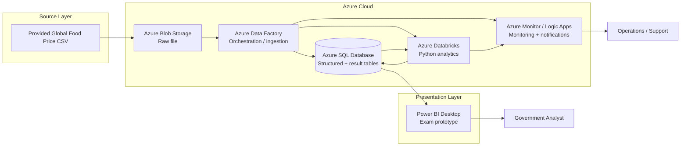
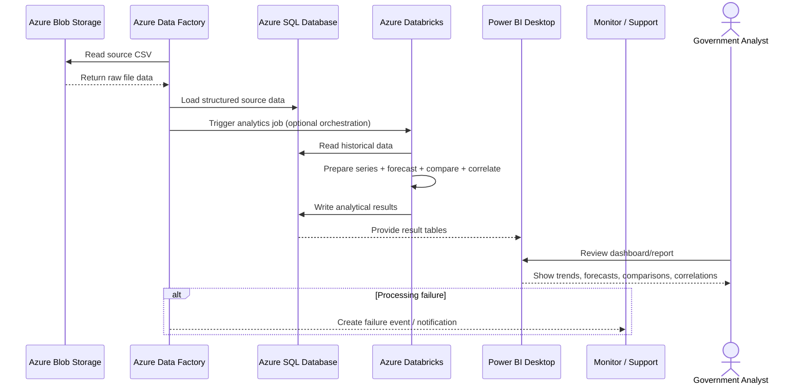

# Solution Architecture
## Big Data in the Cloud — Team 9

**Contract country:** Djibouti  
**Comparison country:** Haiti

## 1. Architecture Goal

The architecture translates the exam requirements into a small, cost-controlled Azure solution that can ingest the supplied global food-price CSV, store the data in SQL, perform forecasting and comparison analysis, present results to government users, and provide basic monitoring and notification capabilities.

The design deliberately separates **storage**, **orchestration**, **structured persistence**, **analytics**, and **presentation** so each component has one clear responsibility.

---

## 2. High-Level Architecture



---

## 3. Why Each Component Exists

### Azure Blob Storage

Blob Storage keeps the original CSV as the **raw source layer**. This preserves the input independently from later transformations and provides a stable cloud location that Azure Data Factory can read from.

### Azure Data Factory

ADF acts as the **orchestration layer**. For the exam prototype, its main role is intentionally simple:

1. read the source file from Blob Storage;
2. load structured data into Azure SQL;
3. optionally trigger the Databricks analytics job;
4. expose run status for monitoring and failure handling.

The source file is static, so ADF is not required because of data volume; it is used to make the ingestion workflow reproducible and automatable.

### Azure SQL Database

Azure SQL is the **structured persistent data layer**. It stores:

- cleaned/prepared historical observations;
- country/commodity/month-level analytical datasets;
- forecast outputs;
- country-comparison outputs;
- correlation outputs;
- processing timestamps/status information where required.

Keeping results in SQL means the presentation layer can read already-computed results without requiring Databricks to remain running.

### Azure Databricks

Databricks provides **on-demand compute** for Python-based analysis, including:

- time-series preparation;
- commodity-level forecasting;
- Djibouti vs Haiti comparison;
- normalized price-movement calculations where direct nominal comparison is not meaningful;
- correlation analysis.

Compute should be started only when needed and stopped/auto-terminated afterwards to control cost.

### Azure Monitor / Logic Apps

Monitoring covers operational requirements. A failure path can create an alert/notification to the team or support role. The exam prototype should demonstrate that failures can be detected and communicated.

### Power BI Desktop

Power BI Desktop is the **exam presentation layer**. It can connect to the SQL result tables and display trends, forecasts, country comparisons, and correlation outputs.

Power BI Desktop is used for the prototype because the exam requires data presentation but does not mandate a specific hosted BI licensing model. A production government deployment would require an agreed shared reporting/access solution.

---

## 4. Processing Sequence



---

## 5. Requirement Traceability

| Requirement need | Architecture response |
|---|---|
| Preserve provided source data | Blob Storage raw layer |
| Digitalize data in SQL | Azure SQL Database |
| Reproducible ingestion | Azure Data Factory pipeline |
| Forecast food prices | Databricks + Python |
| Compare Djibouti and Haiti | Databricks analytical processing + SQL result tables |
| Find possible correlations | Databricks analytical processing |
| Present results | Power BI Desktop for exam prototype |
| Notify on failures | Azure Monitor / Logic Apps |
| Remain within CHF 250 budget | Small managed services, pay-as-you-go, on-demand Databricks compute |

---

## 6. Data Flow

The initial prototype flow is:

```text
Global_food_prices.csv
        |
        v
Azure Blob Storage
        |
        v
Azure Data Factory
        |
        v
Azure SQL Database
        |
        v
Azure Databricks / Python
        |
        v
Azure SQL result tables
        |
        v
Power BI Desktop
```

The important design principle is that **Databricks does not need to remain online for government users to view results**. Databricks computes the analytical outputs and writes them back to SQL. The presentation layer then reads the stored results.

---

## 7. Cost-Control Design

The architecture is intentionally small for the exam workload:

- use pay-as-you-go services;
- use a small Azure SQL tier;
- keep Blob Storage capacity and transaction assumptions small;
- use a limited number of ADF pipeline/activity executions;
- run Databricks only when analytical processing is required;
- configure Databricks auto-termination;
- use Logic Apps Consumption rather than an always-on Standard plan where practical;
- monitor actual Azure spend against the team budget.

The detailed assumptions belong in [`pricing.md`](pricing.md).

---

## 8. Security and Repository Rules

- Do not commit credentials, passwords, storage keys, SAS tokens, or connection strings.
- Use Azure RBAC according to least-privilege principles in the exam environment.
- Keep secrets outside GitHub.
- Raw government/source data should not be exposed publicly through the repository unless explicitly permitted.

---

## 9. Prototype vs Production

This architecture is an **exam prototype**. It demonstrates the required end-to-end cloud solution while remaining cost-controlled.

A production government deployment would require additional decisions around:

- shared BI/reporting licensing and access;
- identity and authorization;
- production backup/retention policy;
- high availability and disaster recovery;
- formal data refresh contracts;
- operational support ownership;
- production security review.
