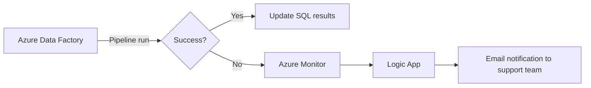
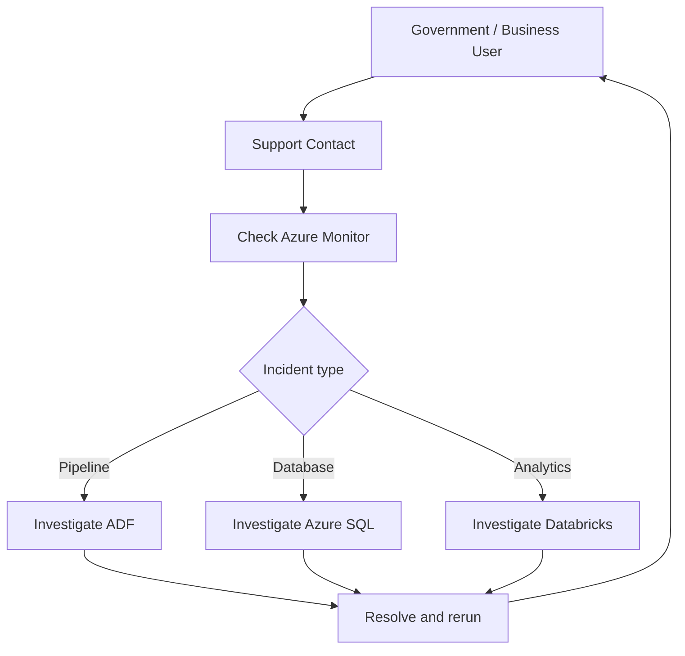

# Service Level Agreement (SLA)

## Big Data in the Cloud – Team 9

**Contract Country:** Djibouti  
**Comparison Country:** Haiti  
**Project:** Food price forecasting and country comparison using Azure

---

## 1. Purpose

This document defines the proposed service-level objectives for the Team 9 Big Data solution.

The course material defines an SLA as an agreement that specifies the expected level of service, the metrics used to measure that service, and possible remedies or penalties if agreed service levels are not achieved.

For this university exam project, the targets below are **proposed design assumptions**. They are not fixed values stated by the exam brief.

---

## 2. Scope of the SLA

The SLA covers the operational parts of the solution:

- Azure Blob Storage for the raw source file
- Azure Data Factory for data ingestion and orchestration
- Azure SQL Database for structured storage
- Azure Databricks for forecasting and correlation analysis
- Azure Monitor / Logic Apps for monitoring and notifications
- Power BI Desktop for presentation during the exam prototype

The SLA focuses on:

- availability of processed data
- successful pipeline execution
- processing time
- notification time after failures
- recovery and support response
- data freshness

---

## 3. Service Level Objectives (SLOs)

| ID | Service Objective | Proposed Target | Measurement |
|---|---|---:|---|
| SLO-01 | Pipeline success rate | >= 95% | Successful ADF pipeline runs / total pipeline runs |
| SLO-02 | Pipeline processing time | <= 30 minutes per scheduled run | ADF run duration |
| SLO-03 | Failure notification time | <= 5 minutes after detected failure | Azure Monitor / Logic Apps timestamps |
| SLO-04 | Data freshness | Updated within 1 hour after a new source file is available | Source arrival time vs. processed-table timestamp |
| SLO-05 | Forecast refresh | Forecast results updated after each successful data refresh | Timestamp in forecast output table |
| SLO-06 | Initial support response | <= 4 business hours for critical incidents | Incident creation time vs. first response |
| SLO-07 | Target recovery time (MTTR) | <= 8 business hours for critical incidents | Incident open-to-resolution duration |

> These targets are proposed for the exam solution and should be adjusted if the lecturer or customer defines different values.

---

## 4. Availability

The solution is not designed as a 24/7 real-time operational system.

The current exam use case is based on a static historical CSV dataset. Therefore, the architecture is designed primarily for:

- scheduled or manually triggered processing
- low-frequency analytical refreshes
- on-demand forecasting
- cost-efficient operation

The reporting layer should remain available using the latest successfully processed results even while Databricks compute is stopped.

---

## 5. Data Freshness

For a future production scenario, the system should support periodic data updates.

Proposed target:

> New source data should be ingested, processed, analysed, and made available to the reporting layer within **1 hour** of the scheduled refresh or file arrival.

For the current exam dataset, this is demonstrated through pipeline execution rather than continuous ingestion.

---

## 6. Incident Priorities

| Priority | Description | Example | Proposed Response |
|---|---|---|---|
| P1 – Critical | Entire pipeline unavailable or no updated results can be produced | ADF pipeline repeatedly fails | <= 4 business hours |
| P2 – High | Major analytical component unavailable but previous results remain available | Databricks forecast job fails | <= 1 business day |
| P3 – Medium | Partial issue with limited user impact | One visual or commodity result is missing | <= 2 business days |
| P4 – Low | Cosmetic or documentation issue | Label or documentation error | Best effort |

---

## 7. Monitoring and Alerting

Azure Monitor and Logic Apps are used to support operational monitoring.

The proposed monitoring flow is:

The system should monitor:

- pipeline success/failure
- pipeline duration
- Databricks job success/failure
- SQL availability
- latest successful refresh timestamp
- Azure cost against the project budget

---

## 8. Recovery Objectives

### Recovery Time Objective (RTO)

Proposed target:

**RTO <= 8 business hours** for a critical processing failure.

This means the team aims to restore the ability to process and publish updated results within 8 business hours.

### Recovery Point Objective (RPO)

Because the raw source file is retained in Blob Storage and the processing pipeline is reproducible, a failed processing run can be repeated.

Proposed target:

**RPO = latest successfully stored source file.**

For the current static exam dataset, data-loss risk is low because the source CSV can be retained unchanged.

---

## 9. Support Model

The proposed support model is:

The support process is:

1. User or monitoring detects an issue.
2. Incident is classified by priority.
3. Azure Monitor and service logs are checked.
4. The affected component is identified.
5. The issue is resolved.
6. The failed process is rerun if needed.
7. The user is informed.

---

## 10. Cost and SLA Relationship

The solution is intentionally designed as a low-frequency analytical system rather than an always-on real-time platform.

This allows the team to:

- keep Databricks compute off when not needed
- use small Azure SQL resources
- use low-cost Blob Storage
- use Azure Data Factory only when pipelines run
- use Logic Apps Consumption for notifications

This supports the exam requirement to stay within the team Azure consumption budget while still providing measurable service objectives.

---

## 11. Assumptions

The following are project assumptions and not explicit exam requirements:

- processing is periodic rather than real-time
- Databricks compute is started only when required
- one primary support contact is sufficient for the prototype
- Power BI Desktop is used for the exam presentation
- production dashboard licensing is outside the current prototype scope
- SLA targets are proposed and can be negotiated with the customer

---

## 12. Summary

The proposed SLA focuses on measurable and practical targets for:

- reliability
- processing time
- data freshness
- incident notification
- recovery
- support

The targets are designed to be realistic for the exam architecture and its cost constraints while demonstrating the service-management concepts covered in the module.
